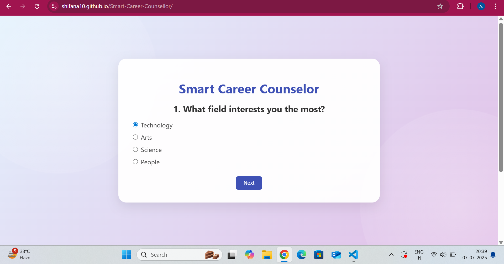

# Smart Career Counsellor 💼🎯

A simple and responsive web-based career guidance platform that helps users explore career paths based on their interests.

## 🚀 Features

- Clean and intuitive UI
- Responsive design (works on desktop & mobile)
- Easy navigation
- Career suggestions section
- **Download career suggestions as a PDF** (using JavaScript)

## 🛠️ Built With

- HTML
- CSS
- JavaScript
- GitHub Pages (for deployment)

## 🌐 Live Demo

🔗 [Click here to view the live project](https://shifana10.github.io/Smart-Career-Counsellor/)

## 📂 Repository

🔗 [GitHub Repo](https://github.com/Shifana10/Smart-Career-Counsellor)

## 📸 Screenshots

  

## 📌 Future Enhancements

- Add quiz-style interest test
- Backend database for storing user results
- More career categories

## 👩‍💻 About Me

I'm an IT undergrad passionate about building web applications and solving problems with code.  
📬 Reach out to me on [LinkedIn](https://www.linkedin.com/in/shifana-ansar-ali-814615291/)

